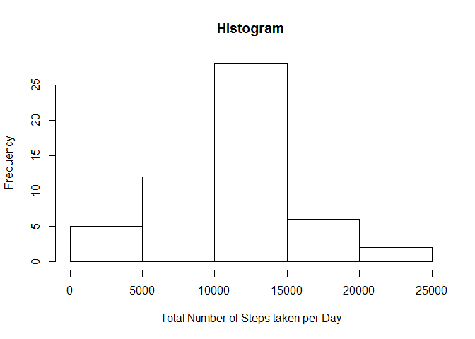
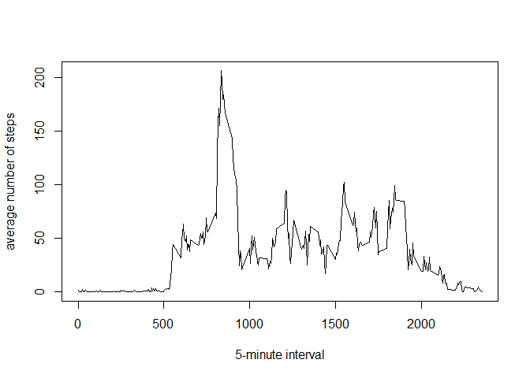

# Reproducible Research: Peer Assessment 1

## Loading and preprocessing the data

```r
activity <- read.csv("activity.csv", header = T, stringsAsFactors = F)
str(activity)
```

```
## 'data.frame':	17568 obs. of  3 variables:
##  $ steps   : int  NA NA NA NA NA NA NA NA NA NA ...
##  $ date    : chr  "2012-10-01" "2012-10-01" "2012-10-01" "2012-10-01" ...
##  $ interval: int  0 5 10 15 20 25 30 35 40 45 ...
```

```r
activity$date <- as.Date(activity$date) 
#activity$date <- as.Date(activity$date, "%Y-%m-%d") 
str(activity)
```

```
## 'data.frame':	17568 obs. of  3 variables:
##  $ steps   : int  NA NA NA NA NA NA NA NA NA NA ...
##  $ date    : Date, format: "2012-10-01" "2012-10-01" ...
##  $ interval: int  0 5 10 15 20 25 30 35 40 45 ...
```

## What is mean total number of steps taken per day?


```r
library(data.table)
activity.DT = data.table(activity)
str(activity.DT)
```

```
## Classes 'data.table' and 'data.frame':	17568 obs. of  3 variables:
##  $ steps   : int  NA NA NA NA NA NA NA NA NA NA ...
##  $ date    : Date, format: "2012-10-01" "2012-10-01" ...
##  $ interval: int  0 5 10 15 20 25 30 35 40 45 ...
##  - attr(*, ".internal.selfref")=<externalptr>
```

```r
dailyStep <- activity.DT[,list(sumSteps=sum(steps)), by=date]
```

###1. Make a histogram of the total number of steps taken each day

```r
hist(dailyStep$sumSteps, xlab="Total Number of Steps taken per Day", ylab="Frequency", main="Histogram")
```

 

###2. Calculate and report the mean and median total number of steps taken per day  

Mean total number of steps taken per day

```r
steps.mean <- mean(dailyStep$sumSteps, na.rm=T) #  ignore the missing values in the dataset
steps.mean
```

```
## [1] 10766.19
```

Median total number of steps taken per day

```r
steps.median <- median(dailyStep$sumSteps, na.rm=T) #  ignore the missing values in the dataset
steps.median
```

```
## [1] 10765
```

 


## What is the average daily activity pattern?

### 1. Make a time series plot (i.e. type = "l") of the 5-minute interval (x-axis) and the average number of steps taken, averaged across all days (y-axis)

```r
meaninterval <- activity.DT[,list(meanintervalSteps=mean(steps, na.rm=T)), by=interval]

plot.ts(meaninterval$interval, meaninterval$meanintervalSteps, type="l", xlab="5-minute interval", ylab="average number of steps")
```

 
### 2. Which 5-minute interval, on average across all the days in the dataset, contains the maximum number of steps?

```r
meaninterval$interval[which.max(meaninterval$meanintervalSteps)]
```

```
## [1] 835
```


## Imputing missing values

1. the total number of rows with NAs :

```r
sum(is.na(activity$steps))
```

```
## [1] 2304
```

2. Devise a strategy for filling in all of the missing values in the dataset. The strategy does not need to be sophisticated. For example, you could use the mean/median for that day, or the mean for that 5-minute interval, etc.

My strategy for filling is using the mean for that 5-minute interval

```r
newdataset <- activity
for(i in 1:nrow(newdataset)){
  if(is.na(newdataset$steps[i])){
    newdataset$steps[i] <- meaninterval[ which(meaninterval$interval==newdataset$interval[i]),]$meanintervalSteps
  }
}
```


```r
#original data 
head(activity)
```

```
##   steps       date interval
## 1    NA 2012-10-01        0
## 2    NA 2012-10-01        5
## 3    NA 2012-10-01       10
## 4    NA 2012-10-01       15
## 5    NA 2012-10-01       20
## 6    NA 2012-10-01       25
```

```r
#a new dataset that is equal to the original dataset but with the missing data filled in.
head(newdataset)
```

```
##       steps       date interval
## 1 1.7169811 2012-10-01        0
## 2 0.3396226 2012-10-01        5
## 3 0.1320755 2012-10-01       10
## 4 0.1509434 2012-10-01       15
## 5 0.0754717 2012-10-01       20
## 6 2.0943396 2012-10-01       25
```
### histogram of the total number of steps taken each day

```r
library(dplyr)
```

```
## 
## Attaching package: 'dplyr'
## 
## The following objects are masked from 'package:data.table':
## 
##     between, last
## 
## The following object is masked from 'package:stats':
## 
##     filter
## 
## The following objects are masked from 'package:base':
## 
##     intersect, setdiff, setequal, union
```

```r
newdataset.daysum <- newdataset %>% group_by(date) %>% summarize(daysum =sum(steps,na.rm = TRUE))
hist(newdataset.daysum$daysum)
```

 


```r
mean(newdataset.daysum$daysum)
```

```
## [1] 10766.19
```

```r
median(newdataset.daysum$daysum)
```

```
## [1] 10766.19
```

first step of mean and median 

```r
steps.mean
```

```
## [1] 10766.19
```

```r
steps.median
```

```
## [1] 10765
```

### What is the impact of imputing missing data on the estimates of the total daily number of steps?  
: imputing of missing value affect to median but not to mean. 

## Are there differences in activity patterns between weekdays and weekends?


```
## [1] "C"
```


```r
#  Use the dataset with the filled-in missing values for this part.
head(newdataset)
```

```
##       steps       date interval
## 1 1.7169811 2012-10-01        0
## 2 0.3396226 2012-10-01        5
## 3 0.1320755 2012-10-01       10
## 4 0.1509434 2012-10-01       15
## 5 0.0754717 2012-10-01       20
## 6 2.0943396 2012-10-01       25
```

```r
newdataset$weekday <- ifelse(weekdays(newdataset$date)=="Sunday"|weekdays(newdataset$date)=="Saturday", "weekend", "weekday")
newdataset$weekday <- factor(newdataset$weekday)
table(newdataset$weekday)
```

```
## 
## weekday weekend 
##   12960    4608
```

```r
head(newdataset)
```

```
##       steps       date interval weekday
## 1 1.7169811 2012-10-01        0 weekday
## 2 0.3396226 2012-10-01        5 weekday
## 3 0.1320755 2012-10-01       10 weekday
## 4 0.1509434 2012-10-01       15 weekday
## 5 0.0754717 2012-10-01       20 weekday
## 6 2.0943396 2012-10-01       25 weekday
```

### 1. Create a new factor variable in the dataset with two levels -- "weekday" and "weekend" indicating whether a given date is a weekday or weekend day.


```r
newdataset.DT <- data.table(newdataset)
newmeaninterval <- newdataset.DT[,list(meanintervalSteps=mean(steps)), by=list(interval, weekday)]
newmeaninterval
```

```
##      interval weekday meanintervalSteps
##   1:        0 weekday        2.25115304
##   2:        5 weekday        0.44528302
##   3:       10 weekday        0.17316562
##   4:       15 weekday        0.19790356
##   5:       20 weekday        0.09895178
##  ---                                   
## 572:     2335 weekend       11.58726415
## 573:     2340 weekend        6.28773585
## 574:     2345 weekend        1.70518868
## 575:     2350 weekend        0.02830189
## 576:     2355 weekend        0.13443396
```


### 2.Make a panel plot containing a time series plot (i.e. type = "l") of the 5-minute interval (x-axis) and the average number of steps taken, averaged across all weekday days or weekend days (y-axis).

```r
library(lattice)
xyplot(newmeaninterval$meanintervalSteps ~ newmeaninterval$interval | newmeaninterval$weekday, 
       layout = c(1, 2), type = "l", 
       xlab = "5-minutes interval", ylab = "the average number of steps")
```

 
